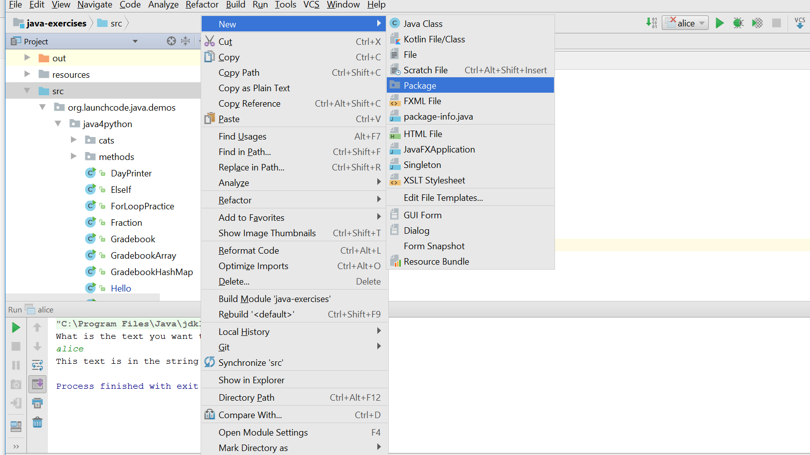
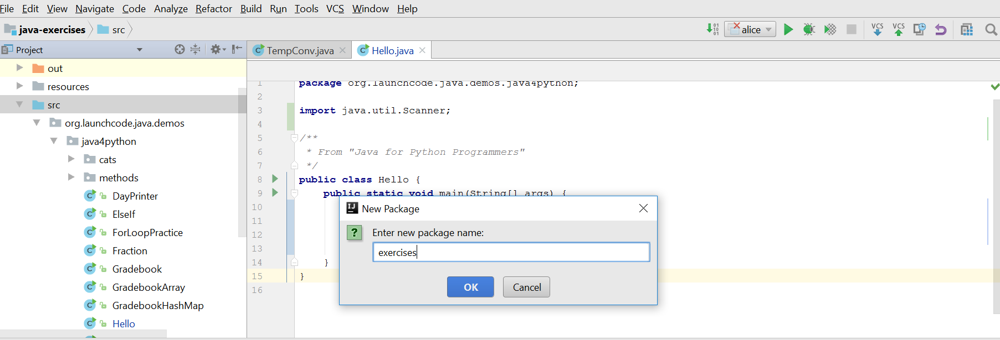
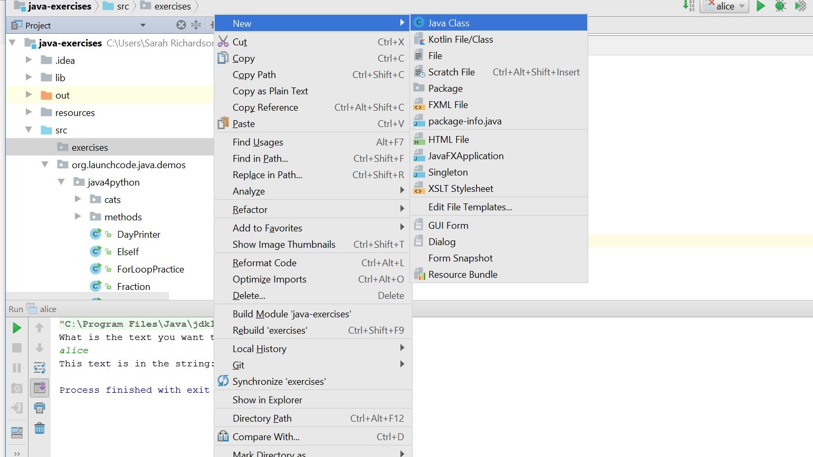
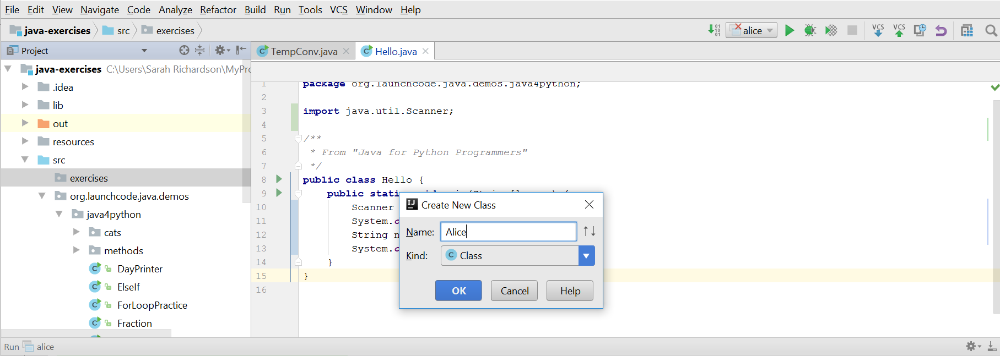
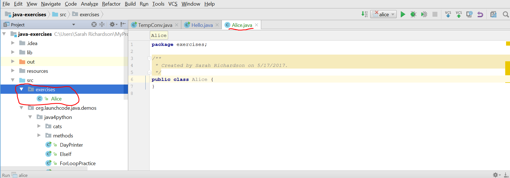

## Instructions

Work on these exercises in the `java-exercises` project, creating a new class for each. You may name the classes whatever you like, but use proper [Java naming conventions](../../java4python/naming-conventions/) and make sure that the file name matches the class name!

Here is how to create a new package to store these exercises, and how to create new classes within this package:

1. Click on the folder `src` in the Project pane, then right click and select "New" and then select "Package".



2. Name the package "exercises".



3. Then click on the newly-created folder `exercises` and right click to select "New" and then select "Class".



4. Name the package what you will name your class (for example, in the 4th exercise below, you might name the class `Alice`).  
**Note:** You will be asked whether you want to add this file to Git. Press the "Yes" button.



5. The new class is now created! You can proceed to write code within it. (Don't forget to write the `main` method!)



## Exercises

1. **Input/output**: Modify your "Hello, World" program to prompt the user for their name, and greet them by name.
1. **Numeric types**: Write a program to calculate the area of a rectangle and print the answer to the console. You should prompt the user for the dimensions. (What data types should the dimensions be?)
2. **Numeric types**: Write a program that asks a user for the number of miles they have driven and the amount of gas they've consumed (in gallons), and print their miles-per-gallon.
3. **Strings**: The first sentence of *Alice's Adventures in Wonderland* is below. Store this sentence in a string, and then prompt the user for a term to search for within this string. Print whether or not the search term was found. See if you can make the search case-insensitive, so that searching for "alice", for example, prints `true`.
    ```nohighlight
    Alice was beginning to get very tired of sitting by her sister on the bank, and of having nothing to do: once or twice she had peeped into the book her sister was reading, but it had no pictures or conversations in it, 'and what is the use of a book,' thought Alice 'without pictures or conversation?'
    ```
