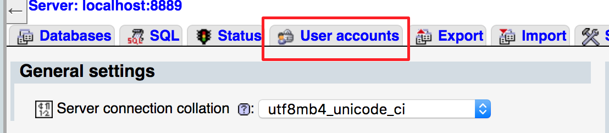
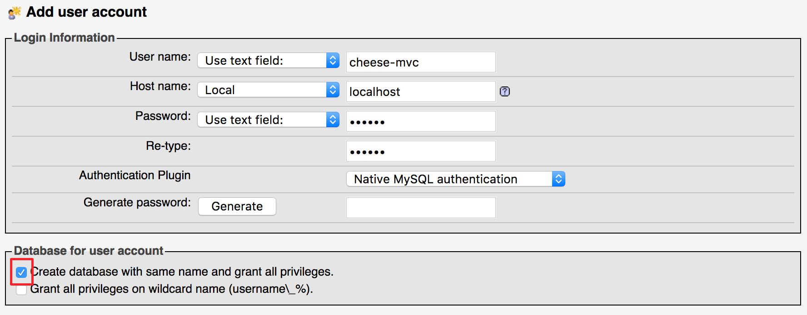

This article walks you through the steps needed to setup a Spring Boot application to use MySQL for local development.

## Install MAMP

MAMP is a suite of tools useful for developers. The acronym MAMP stands for Mac / Apache / MySQL / PHP, and despite the first term, there is a version for Windows as well. While we won't use Apache and PHP directly, they'll provide us with an interface to work with our MySQL server, called *phpMyAdmin*.

[Install MAMP for your system](https://www.mamp.info/en/). *Do not* install MAMP Pro, which is not free.

<aside class="aside-note" markdown="1">
If you use Linux, you should install, at a minimum, the MySQL 5.x package for your system. You might also install phpMyAdmin or another MySQL management application.
</aside>

## Setting Up the Database

Start up MAMP. From the launcher window, select *Start Servers*. Once that button has turned green, choose *Open Start Page*. From the page that opens up in your browser, select *Tools > phpMyAdmin*.

Select *User Accounts*.



Fill out the resulting form with info for your application. A good pattern to follow is that you should have a different user for each application, and the username should match the name of your application.

Set the *Host name* field to *Local* and set a password. For local development, it's acceptable to use a simple password. Just be sure that you don't use the same password on a production database if you deploy your application!

And be sure to check the first checkbox under *Database for user account*. If you don't do this, you'll have to create a database and set permissions manually.



## Configuring Your Spring Boot App

These steps will need to be carried out for each application that you want to work with a database.

### Dependencies

Make sure these lines are in the `dependencies` section of your `build.gradle`:
```nohighlight
compile('org.springframework.boot:spring-boot-starter-data-jpa')
compile('mysql:mysql-connector-java')
```

The `spring-boot-starter-data-jpa` artifact includes the Hibernate ORM framework. We won't talk explicitly about Hibernate very much, since we won't need to work with it directly in most situations. We'll primarily work with Java Persistence API annotations, but you should know that Hibernate provides the implementation for most of these behaviors behind the scenes. In settings other than Spring Boot, you'd likely work with Hibernate much more directly.

### `application.properties`

The database connection needs to be configured via `src/main/resources/application.properties`. Make sure these lines are in that file:

```nohighlight
# Database connection settings
spring.datasource.url=jdbc:mysql://localhost:8889/cheese-mvc
spring.datasource.username=cheese-mvc
spring.datasource.password=cheese

# Specify the DBMS
spring.jpa.database = MYSQL

# Show or not log for each sql query
spring.jpa.show-sql = false

# Hibernate ddl auto (create, create-drop, update)
spring.jpa.hibernate.ddl-auto = update

# Use spring.jpa.properties.* for Hibernate native properties (the prefix is
# stripped before adding them to the entity manager)
spring.jpa.properties.hibernate.dialect = org.hibernate.dialect.MySQL5Dialect
```

<aside class="aside-note" markdown="1">
If you are Windows or Linux, you may need to set your port in the second line to 3306.

```nohighlight
spring.datasource.url=jdbc:mysql://localhost:3306/cheese-mvc
```

To check what the MySQL port is set to under MAMP, check the MAMP preferences.
</aside>

The username and password, along with the database name in the datasource URL, should match the values you used when creating your database in MAMP.

<aside class="aside-note" markdown="1">
We've assumed that you are using the default MAMP port settings. If you've changed those, be sure to update the datasource URL accordingly.
</aside>

These properties are discussed in more depth in the [Spring Boot Persistence cheatsheet](https://github.com/LaunchCodeEducation/cheatsheets/blob/master/spring-persistence/).

Now your app is configured to use Hibernate with MySQL. You'll need to make some additions and changes to your Java code to specify how object should be mapped into the database. This is the topic of upcoming lessons.
