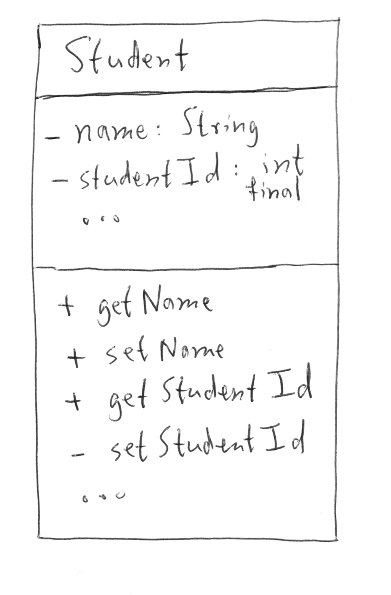
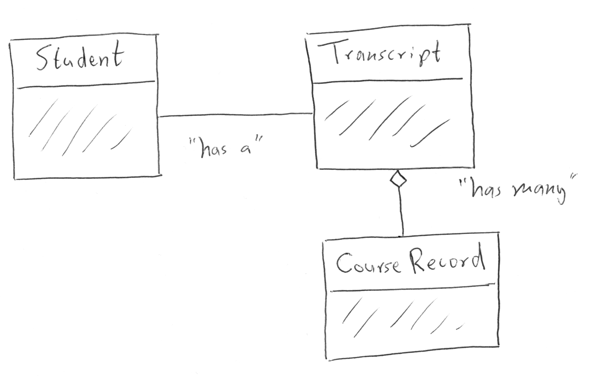

We have mentioned a few times the importance of designing your classes before starting to write code. It's important to think about the fields, properties, and methods of your classes, and the relationship of your various classes to each other. Doing so will not only result in better code, but will also mean that you're less likely to have to rewrite your code due to lack of foresight.

**Class diagrams** are informal tools for sketching out class design. They are often discussed in the context of the [Unified Modeling Language](https://en.wikipedia.org/wiki/Unified_Modeling_Language), but most programmers use them much less formally. This will be our approach as well.

We'll introduce you to a few widely-used conventions used when drawing class diagrams. These guidelines are by no means comprehensive, and they should not be thought of as rules in the sense of syntax rules. There's no compiler to yell at you for not drawing a class diagram properly! Instead, we encourage you to use class diagrams as planning and communication tools. Use as many or as few of the conventions as you like based on your need.

Class diagrams can be created within some IDEs (including IntelliJ) and with specialized software. However, most of the time you'll be drawing them by hand, so that's what we'll do here.

## Diagramming a Single Class

In diagramming a single class, we create a box and divide it into three sections:
- **Top**: Class name
- **Middle**: Fields
- **Bottom**: Methods

For fields we can specify additional useful information, such as access level and data type. For methods we can similarly specify access level, return type, and input parameter types. We will often use "**+**" as shorthand for public, and "**-**" as shorthand for private. If we want to indicate that some methods or fields are omitted, we can use ellipses "**...**".

## Diagramming Class Relationships

What's even more useful than just diagramming a single class is diagramming the relationships between the classes within our programs.

Suppose we were designing a program to track students and the classes that they have taken. We might think about three classes:
- `Student`: Represents an individual student
- `Transcript`: Represents a student's transcript, including classes that they have taken
- `CourseRecord`: Represents an individual course that a student has completed, along with the grade achieved.

We can represent these three classes and their relationships to each other in the following diagram:

We've omitted the fields and methods of these classes since in this situation we're only concerned with the relationships. The lines between each are different, and convey different information.

A plain, solid line between two classes indicates a **one-to-one relationship**. For each `Student` there is one `Transcript`, and a `Transcript` can be owned by only one `Student`.

A line with an open diamond on the end indicates a **one-to-many relationship**. Each `Transcript` has many `CourseRecord` objects.

Another type of relationship that we have recently encountered is the *is-a* relationship of inheritance. This can be expressed via a class diagram by using an arrow, directed from the subclass to the base class.

There are many more ways to express relationships in class diagrams, and you'll even see slight variations in usage of lines and the so-called "decorators" used to specify the type of relationship.

For most purposes, your main concern should be visually communicating information about your program design. To that end, if you are going to share your diagram with somebody else, it's always helpful to use a key to indicate the specific meaning you have attached to each symbol used.

If you'd like to learn a bit more about informal class diagrams, we've collected some [short, relevant videos](https://www.youtube.com/playlist?list=PLs5n5nYB22fK7H_y0u65lsssbbD8zGAE8).

## References

- [Class Diagram (Wikipedia)](https://en.wikipedia.org/wiki/Class_diagram)
