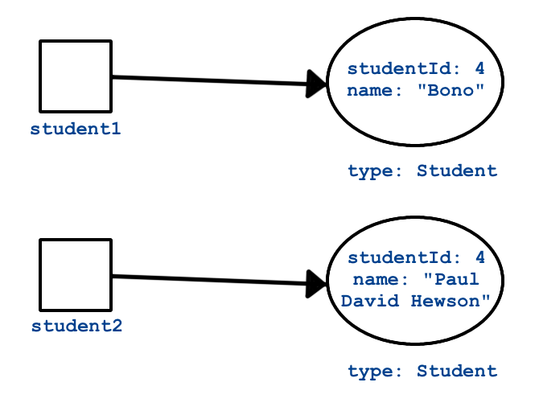

Having explored configuring data within classes (via fields and properties), let's turn our attention to behavior (methods).

## Calling Methods on Objects

A **method** is a procedure that belongs to a class. In Java, all procedures must be part of a class, a significant difference from Python, where functions may stand on their own. Let's revisit our minimal class example.


```java
public class HelloWorld {

    private String message = "Hello World";

    void sayHello() {
        System.out.println(message);
    }

}
```

There is one method in this class, `sayHello`. In order to call this method, we must have an object created from the `HelloWorld` class template. In other words, we must have an instance of `HelloWorld`.

Here's how you call methods on an object.

```java
HelloWorld hello = new HelloWorld();
hello.sayHello();
```

It is not possible to call `sayHello` without having a `HelloWorld` object. This begins to make more sense when you note that the `message` field is used within `sayHello`, and unless we are calling `sayHello` off of an object, there will be no `message` field available to print.

<aside class="aside-pro-tip" markdown="1">
As mentioned before, methods should have the most restrictive level of access possible. If you create a utility method that should only be used within your class, then it should be `private`.

Only make methods `public` when you expect others to use them, and when you are committed to maintaining those methods for other programmers that might use them.
</aside>

## Constructors

**Constructor methods** allow for initialization behavior to occur when creating a new object from our class template. We have been using constructor syntax in our lessons, but we haven't yet seen how to create constructors for our own classes. For example, we created new `ArrayList` objects using the `new` keyword along with the `ArrayList` constructor:

```java
ArrayList<String> myList = new ArrayList<>();
```

In Java, constructors have the same name as the class and are most often declared public (though they can be private in certain situations). They are declared **without a return type**. Any function that is named the same as the class and has no return type is a constructor.

Here is an example of a constructor definition within the `HelloWorld` class:

```java
public class HelloWorld {

    private String message = "Hello World";

    public HelloWorld(String message) {
        this.message = message;
    }

    void sayHello() {
        System.out.println(message);
    }

}
```

This constructor allows us to create `HelloWorld` objects with custom messages. The assignment `this.message = message` assigns the value passed into the constructor to the field `message`. Here's how we might use it:

```java
HelloWorld goodbye = new HelloWorld("Goodbye World");
goodbye.sayHello(); // prints "Goodbye World"
```

<aside class="aside-warning" markdown="1">
It's not required that every class to have a constructor. If you don't provide one, the Java compiler will generate an "empty" constructor for you, known as a **default constructor**. For example, when we left out a constructor in our `HelloWorld` class above, the compiler created the following constructor for us:

```java
public HelloWorld() {}
```

Be careful with this; you almost always want to provide a constructor to properly initialize your objects.
</aside>

### Overloading Constructors

We can provide multiple constructors for a given class in order to allow for different initialization scenarios. This is known as **constructor overloading**. More generally, **method overloading** refers to the practice of defining different methods with the same name and return type, but different input parameters.

Let's expand upon our `Student` class from the last section.

```java
public class Student {

    private String name;
    private final int studentId;
    private int numberOfCredits;
    private double gpa;

    public Student(String name, int studentId,
            int numberOfCredits, double gpa) {
        this.name = name;
        this.studentId = studentId;
        this.numberOfCredits = numberOfCredits;
        this.gpa = gpa;
    }

    public Student(String name, int studentId) {
        this.name = name;
        this.studentId = studentId;
        this.numberOfCredits = 0;
        this.gpa = 0.0;
    }

    /* getters and setters omitted */

}
```

The first constructor allows for creation of `Student` objects where the code creating the object provides all of the fields. The second allows for creation of `Student` objects with only `name` and `studentId`. The first constructor would be most useful for creating a transfer student, where credits and a GPA might already be non-zero. However, for all new students, it would be safe to initialize `numberOfCredits` and `gpa` to be 0.

A better way to write the above constructors would be this:

```java
public class Student {

    private String name;
    private final int studentId;
    private int numberOfCredits;
    private double gpa;

    public Student(String name, int studentId,
            int numberOfCredits, double gpa) {
        this.name = name;
        this.studentId = studentId;
        this.numberOfCredits = numberOfCredits;
        this.gpa = gpa;
    }

    public Student(String name, int studentId) {
        this(name, studentId, 0, 0);
    }

    /* getters and setters omitted */

}
```

Here, we use `this()` to invoke another constructor within the same class. In this case, the second constructor calls the first with the "default" values for `studentId` and `gpa`. If you use this syntax, the call to `this()` must be the first line in the constructor. This is a good practice not only because it makes your code shorter, but because allows any initialization behavior that may be carried beyond just initializing variables to be contained in a smaller number of constructors.

Note that a constructor often won't take values for all of the fields that need to be initialized, beyond even the case of default values. For example, we might also provide provide a third constructor that only requires the student's name, since theoretically the `studentId` would (or could) be generated by the class itself.

```java
public class Student {

    private static int nextStudentId = 1;
    private String name;
    private final int studentId;
    private int numberOfCredits;
    private double gpa;

    public Student(String name, int studentId,
            int numberOfCredits, double gpa) {
        this.name = name;
        this.studentId = studentId;
        this.numberOfCredits = numberOfCredits;
        this.gpa = gpa;
    }

    public Student(String name, int studentId) {
        this(name, studentId, 0, 0);
    }

    public Student(String name) {
        this(name, nextStudentId);
        nextStudentId++;
    }

    /* getters and setters omitted */

}
```

In this example, we add a static integer field that will keep track of the next student ID available to be assigned to a student. Then, our new constructor takes only a name, and assigns the student the next available value. This works because static fields are shared across all objects created from the `Student` class, so it functions as a counter of sorts for the number of `Student` objects created.

<aside class="aside-pro-tip" markdown="1">
When defining constructors, think about:
1. Which fields must be initialized properly for your class to work properly? Be sure you initialize every such field.
1. Which fields should be initialized by the user creating an object, and which should be initialized by the class itself?
2. What are the use-cases for your class that you should provide for?
</aside>

## Instance Methods

So far we've only looked at examples of methods that are relatively specialized: constructors, getters, and setters. Every class you create will have these methods. What will make your classes different from each other, and effective, are the specific behaviors that are unique to your classes.

Let's add a couple of such methods to our `Student` class. These methods will be **instance methods** since they will belong to each `Student` object created, and will use the data of each such object.

What are the behaviors that our `Student` class should have? To start, it would make sense for a student to take a class and get a grade, and for their data to be updated accordingly. Additionally, it would be nice to be able to easily tell the grade level of a student -- freshman, sophomore, junior, or senior.

Our last look at the `Student` class stubs out these methods, without providing the implementation. That job is left to you to do as an exercise.

```java
public class Student {

    private static int nextStudentId = 1;
    private String name;
    private int studentId;
    private int numberOfCredits;
    private double gpa;

    public Student(String name, int studentId,
            int numberOfCredits, double gpa) {
        this.name = name;
        this.studentId = studentId;
        this.numberOfCredits = numberOfCredits;
        this.gpa = gpa;
    }

    public Student(String name, int studentId) {
        this(name, studentId, 0, 0);
    }

    public Student(String name) {
        this(name, nextStudentId);
        nextStudentId++;
    }

    public void addGrade(int courseCredits, double grade) {
        // Update the appropriate fields: numberOfCredits, gpa
    }

    public String getGradeLevel() {
        // Determine the grade level of the student based on numberOfCredits
    }

    /* getters and setters omitted */

}
```

When creating your classes, think about the behaviors that you want to make available, as well as the access level of those methods.

## Static Methods

Static methods are not new to us. We've used them quite a bit, all the way back to our first Java method: `public static void main(String[] args)`. Let's present them in context of the rest of what we've recently learned about classes, however.

Analogous to static fields, **static methods** belong to a class, and not to any of the objects created by the class. Thus, they are sometimes also called **class methods**.  A static method is can be thought of as the opposite of an instance method, since the two cases are mutually exclusive, and one relies on data from an object (instance methods) while the other must *not* rely on data from an object (static methods).

A static method may be called by preceding it with the class name, using dot-notation. Here's an example that we looked at previously.

```java
public class HelloMethods {

    public static void main(String[] args) {
        String message = Message.getMessage("fr");
        System.out.println(message);
    }

}
```

```java
public class Message {

    public static String getMessage(String lang) {

        if (lang.equals("sp")) {
            return "Hola Mundo";
        } else if (lang.equals("fr")) {
            return "Bonjour le monde";
        } else {
            return "Hello World";
        }
    }
}
```

The call in question is: `Message.getMessage("fr")`. We call the static method `getMessage` without needing an instance of the `Message` class, using the name of the class itself.

<aside class="aside-warning" markdown="1">
It is technically allowed to call a static method using an instance of a class: `myObject.someStaticMethod()`. However, this should be avoided in favor of using the class name to call the method.
</aside>

A method should be static when it does not refer to any instance fields of the containing class (it *may* refer to static fields, however). These methods tend to be utility-like, carrying out a calculation, or using or fetching some external resource.

## Special Methods

Every class has a few special methods that belong to it, regardless of whether or not we define them. Exactly how every class obtains these methods will be explored in a future lesson. For now, let's look at the most important of these methods.

### toString

The `toString` method returns a string representation of a class. Calling `toString` on a class that you've written will result in something like this:

```nohighlight
org.launchcode.java.demos.java4python.school.Student@61bbe9ba
```

Here, we called `toString` on a `Student` object. Generally, the default `toString` implementation is not very useful, and you'll want to override it. You can write your own `toString`. Here's how we might do it for `Student`:

```java
public String toString() {
    return name + " (Credits: " + numberOfCredits + ", GPA: " + gpa + ")";
}
```

This would result in a much more friendly message:

```nohighlight
John (Credits: 0, GPA: 0.0)
```

Note that `toString` is often implicitly called for you. For example, the output above could have been generated by the following code, which calls `toString` on `john` within `System.out.println`.

```java
Student john = new Student("John");
System.out.println(john);
```

### equals

Suppose we had two objects of type `Student`, say `student1` and `student2`, and we wanted to determine if they were equal. We might try to compare them using `==`, but since these are [references](../data-types#references) -- that is, the variables hold a reference, or the address of the actual `Student` objects -- they will be determined to be equal only when they have the same address. In other words, they will be equal only when they refer to, or point at, the exact same object. This is often not what we want. For example, we might want to consider two student objects equal if they had the same name, email, or student ID.

The `equals()` method can be used to determine of one object is equal to another in this sense. We introduced this method when discussing strings, but it also applies to all other classes. Here's now you might use it:

```java
Student bono1 = new Student("Paul David Hewson", 4);
Student bono2 = new Student("Bono", 4);

if (bono1.equals(bono2)) {
    System.out.println(bono1.getName() +
        " is the same as " + bono2.getName());
}
```

If we don't provide our own `equals()` method, then the one provided for us will only consider two objects equal if they are the *exact same object*. In other words, they will only be considered equal if the variables referring to the given objects both point at the same object. This is the same behavior that we would see when using the `==` operator: `bono1 == bono2`. This expression will evaluate to true only if the variables actually refer to the same object.

This is often not what we want. The difference between the comparison carried out by the default `equals()` method and the `==` operator, and how we would like our classes to behave, is the difference between *equality* and *identity*. Two things can be considered equal if they are not the exact same item, that is, if they are not identical.

In the case of the `Student` class, we might specify that two `Student` objects are equal if they have the same ID:

```java
public boolean equals(Object o) {
    return ((Student) o).getStudentId() == getStudentId();
}
```

Here's what this looks like conceptually:

**Equality**



**Identity**


You'll often want to implement `equals()` yourself. However, if you do so, be sure to understand best practices around how the method should behave, which are [not so simple][implementing-equals]. In fact, the `equals()` method we have here isn't very good by most Java programmers' standards. We'll dedicate time to learning how to best write an `equals()` method in a future lesson.

One catch of working with `equals()` is that its input parameter must be of type `Object`, even if we're working in a class like `Student`. The reason why will become more clear in the next lesson, where we introduce the `Object` class. For now, the practical implication is that we must convert, or **cast**, the input `o` to be of type `Student` with the syntax `(Student) o`. Then we compare the converted student's ID to that of the current student.

<aside class="aside-pro-tip" markdown="1">
Seasoned Java developers will tell you that every time you implement your own version of `equals()` you should also implement your own version of `hashCode()`. `hashCode()` is another special method that every class has. Understanding `hashCode()` would take us a bit far afield at this point, but we would be remiss to not mention it. If you want to read more, [go for it][implementing-hashcode]!
</aside>

While you may not need to write your own `equals` method for each class you create, the more immediate implication for you as a new Java programmer is that you should *always use* `equals()` yourself when comparing objects. This is especially true when working with objects of types provided by Java, such as `String`. A class that is part of Java or a third-party library will have implemented `equals()` in a way appropriate for the particular class, whereas `==` will only check to see if two objects are the same literal object.

## Single Responsibility Principle

As we wrap up our whirlwind tour of encapsulation, we want you think a bit about how to go about building good classes. Doing so is more of an art than a science, and it will take you lots of practice and time. However, there are a few rules that we've pointed out to help guide you. Here's one more.

From [Wikipedia][srp]:

<aside class="aside-definition" markdown="1">
The **single responsibility principle** states that every module or class should have responsibility over a single part of the functionality provided by the software, and that responsibility should be entirely encapsulated by the class.
</aside>

It isn't always clear what "responsibility over a single part of the functionality" means. However, it is often very clear what it doesn't mean. For example, we wouldn't think of adding functionality to the `Student` class that tracked all of the data for each of the student's classes, such as catalog number, instructor, and so on. Those are clearly different areas of responsibility. One way to interpret the Single Responsibility Principle is to say that "classes should be small."

As you go forth and create classes, the main thing to keep in mind is that your skill and judgement in creating Java classes will improve over time. The best way to improve is to write lots of code, ask lots of questions, and continue learning!

## References

- [Defining Methods (docs.oracle.com)](https://docs.oracle.com/javase/tutorial/java/javaOO/methods.html)
- [Constructors (docs.oracle.com)](https://docs.oracle.com/javase/tutorial/java/javaOO/constructors.html)
- [Passing Data to a Method or Constructor (docs.oracle.com)](https://docs.oracle.com/javase/tutorial/java/javaOO/arguments.html)
- [How to Implement Java’s equals Method Correctly][implementing-equals]
- [How to Implement Java’s hashCode Correctly][implementing-hashcode]
- [Single Responsibility Principle][srp]

[implementing-equals]: https://www.sitepoint.com/implement-javas-equals-method-correctly/
[srp]: https://en.wikipedia.org/wiki/Single_responsibility_principle
[implementing-hashcode]: https://www.sitepoint.com/how-to-implement-javas-hashcode-correctly/
