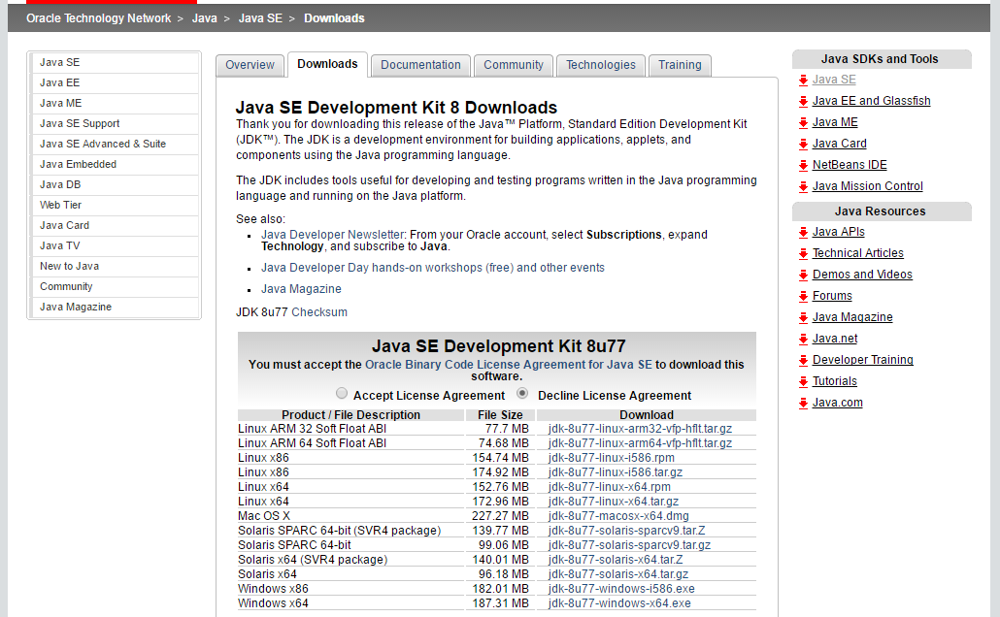
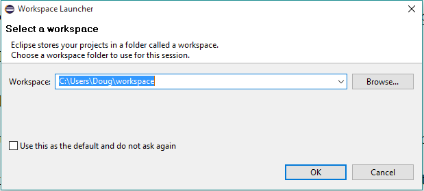
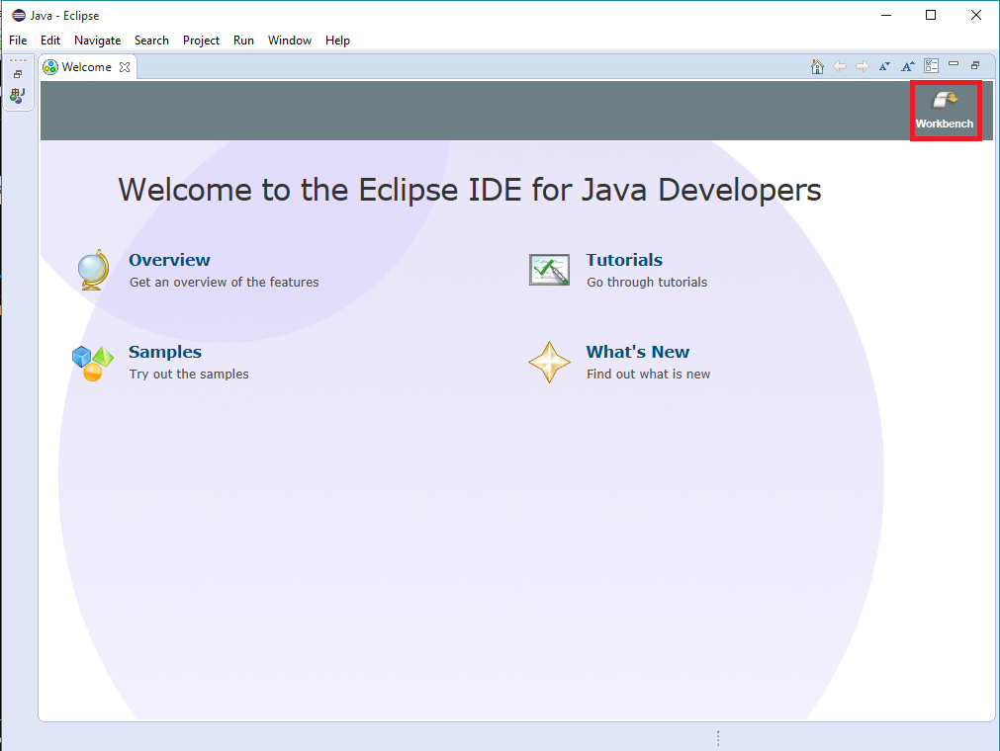
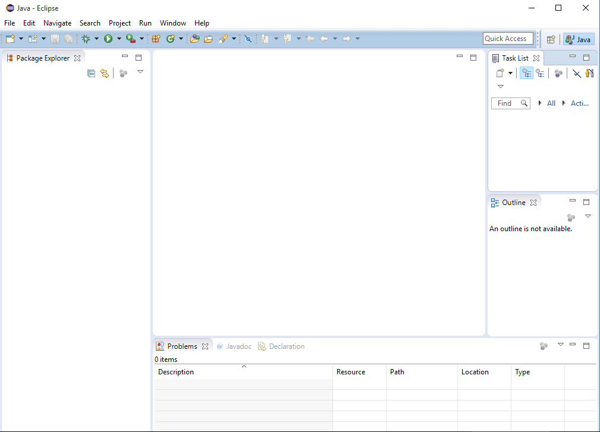

##### Java Track

[Back to Class 0 prep](../../class0-prep)

# Exercise: Eclipse

To get started writing Java applications, we first need to install a couple of things. The Java Development Kit provides things that are necessary for creating and running Java programs on your computer, such as a Java compiler.

To get it, go [here](http://www.oracle.com/technetwork/java/javase/downloads/jdk8-downloads-2133151.html). Be sure to select the license agreement as shown in the screenshot, and download the version appropriate for your machine. This will likely be either the Mac OS X, or Windows x64 versions, but if you are unsure, please ask.

After downloading the file (it will take a minute) follow the instructions for installing it.

Next, we are going to download and install an IDE called Eclipse. Eclipse is specifically designed for Java programs, which makes it a very useful tool.

To get Eclipse, go [here](https://eclipse.org/downloads/) and download the installer, then follow the installation instructions. When you are finished, start Eclipse. It will prompt you to enter a workspace:

You may use the default workspace folder, or choose a new folder if you wish.

Once you select a workspace, you will see this screen. Click the arrow on the top right to be taken to the workbench:

This IDE behaves in much the same way as the CS50 IDE that you've already been using, but it does have some additional features related to Java development. We will go over some of these features in future exercises.

That's it! You are now ready to start creating Java programs. Why don't you start by taking a look at a [Hello, World! program](https://youtu.be/tDtfnf37EeQ).
