##### Java Track

[Back to Class 0 prep](../../class0-prep)

# Exercise: Git
The first thing you will need to do is set up a <a href="http://www.bitbucket.org">BitBucket</a> account. Once you have an account, search for the repository by typing "LaunchCode-JavaTrack" into the search box:

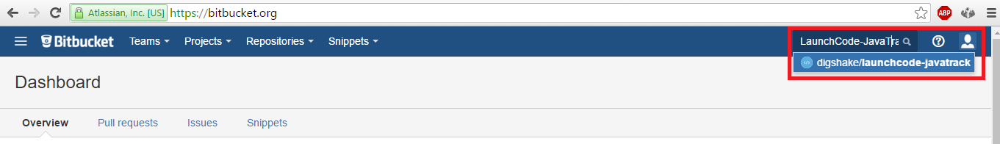

Click on the LaunchCode-JavaTrack Repo. It will take you to the following page. Click the "Fork" link:

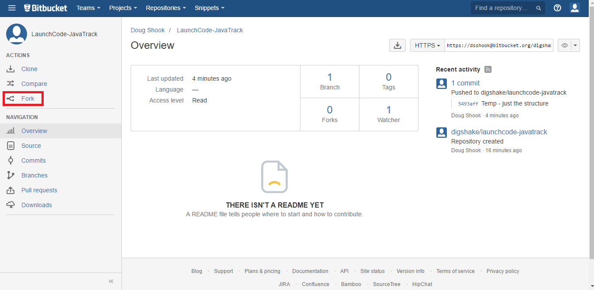

Add your last name to the name of the repository as shown (please do not use my name!). Make sure the repository is set as private, and set the forking policy to disallow forks.

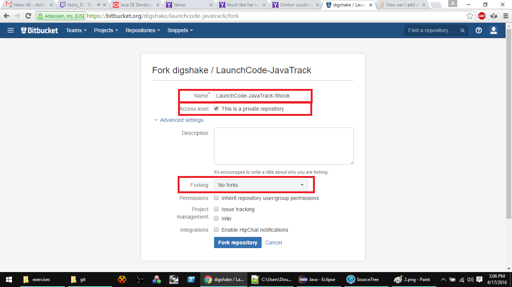

Once you have finished setting up your repository on BitBucket, you need to create a clone of your repository on your local machine. First, go to the BitBucket page for your repository and copy the link:

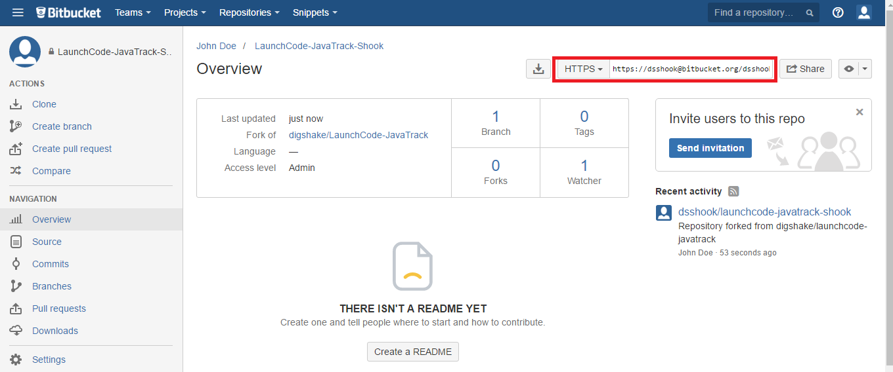

Next, open Eclipse and go into your workspace:

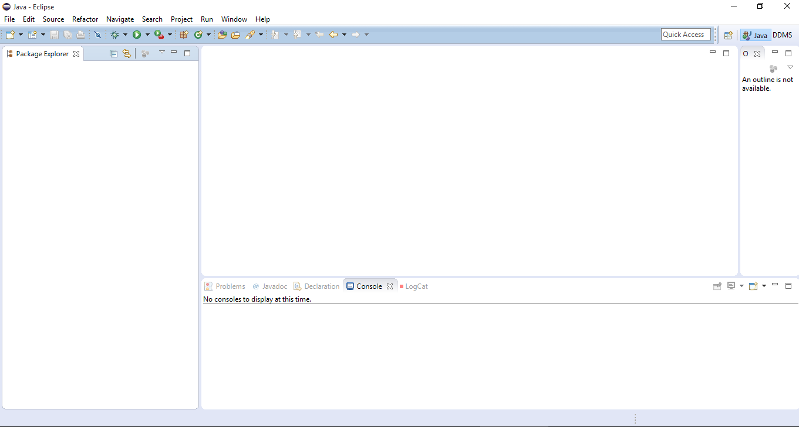

Go to File -> Import. Then select Git project from the list:

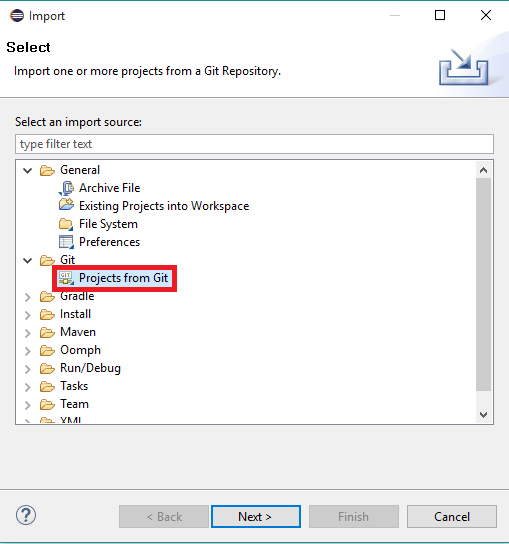

Next, select "Clone URI":

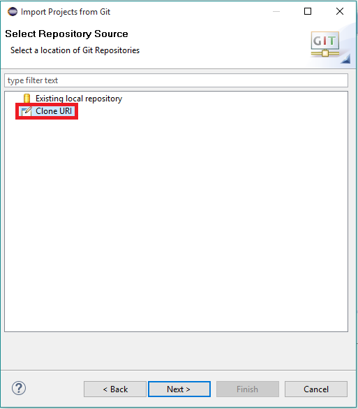

Paste the link that you copied from BitBucket into the box at the top. Fill in your BitBucket login (not your WUSTL key!) at the bottom:

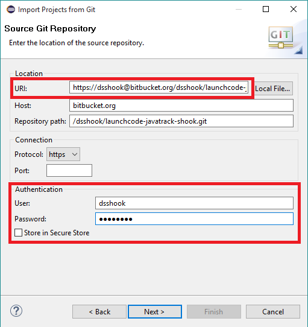

Keep clicking next until you see the following screen. Make sure the box next to the LaunchCode project is checked:

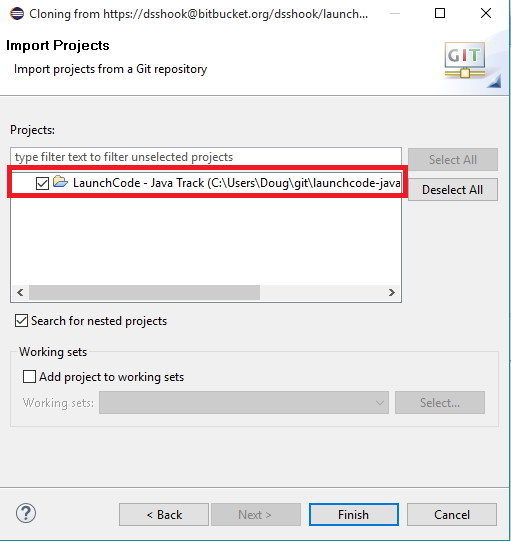

Once you click "Finish", you should see the project in your workspace. It should contain folders for psets, exercises, studios, and walkthroughs.

###Committing your work

Committing your work is equivalent to saving it. When you are ready to save your work, right click the project and select Team-> Commit:

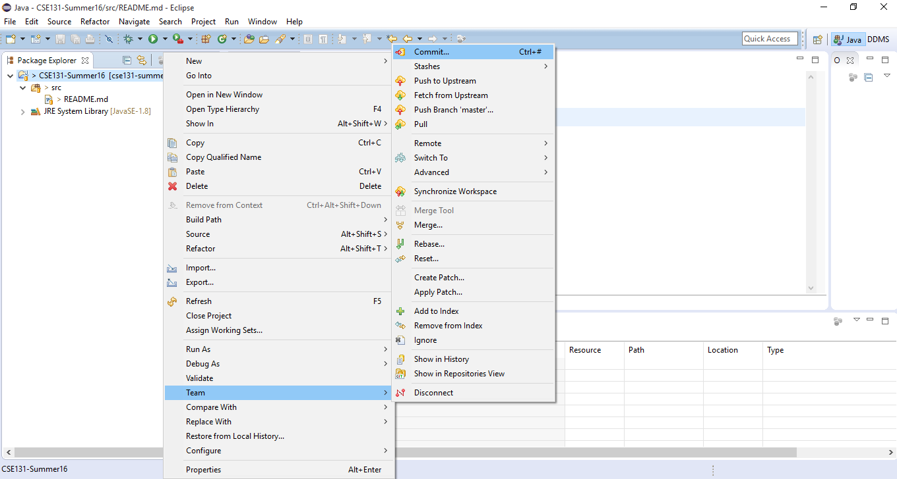

Type in a descriptive commit message then push the "Commit and Push" button at the bottom. Make sure to push! If you only commit (without the push) your work will only be saved on your computer, not in the cloud. This means that other people (such as your team members) will not be able to access it.

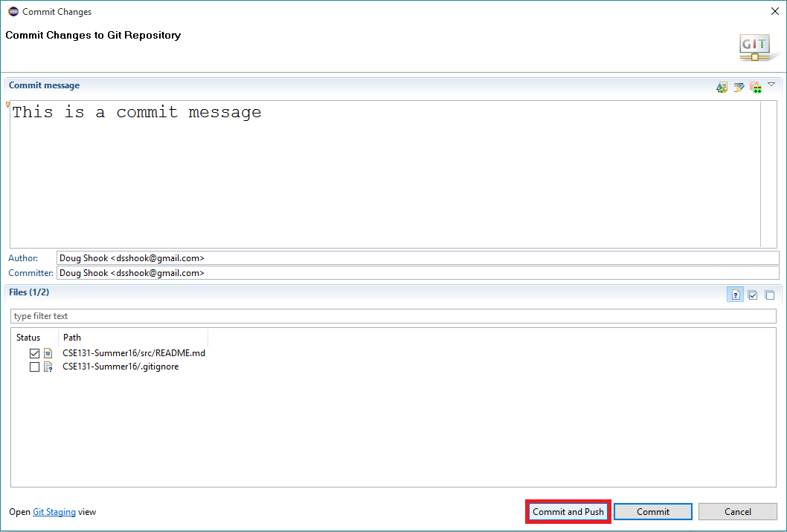

###Updating your repository

From time to time we may add files to your repository (such as new psets and exercises). If you are working with a partner, you will want to be able to see the work that they have done. To do this, you need to update your repository. This can be accomplished by right clicking the CSE131 project and selecting "Synchronize":

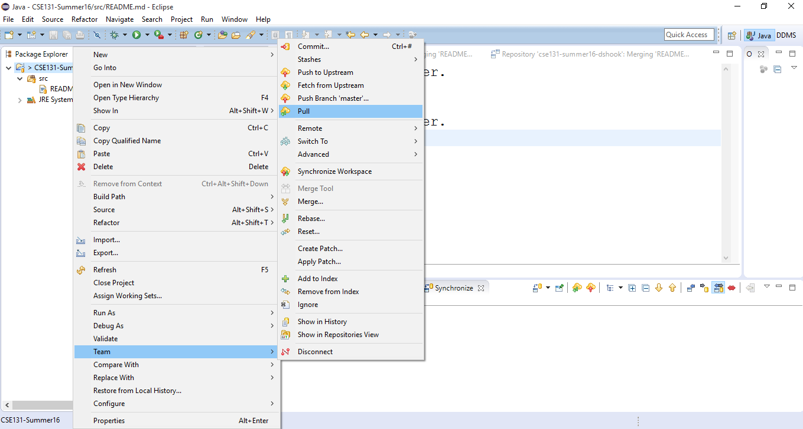

This will get any changes that have been made to your repository. It is a good habit to run a pull before you make any changes to your repository, especially if you are working with a partner.
