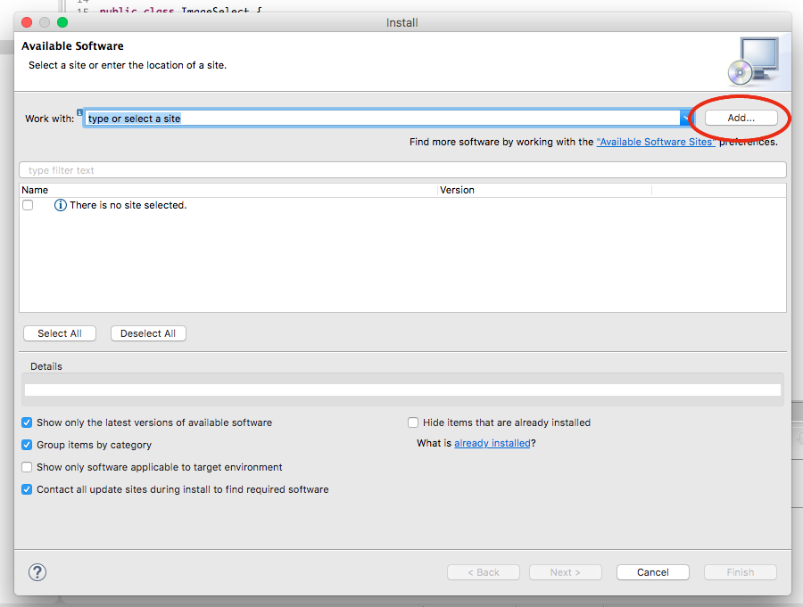
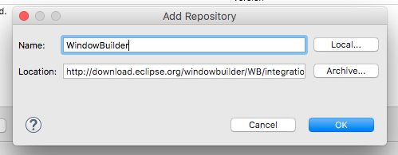
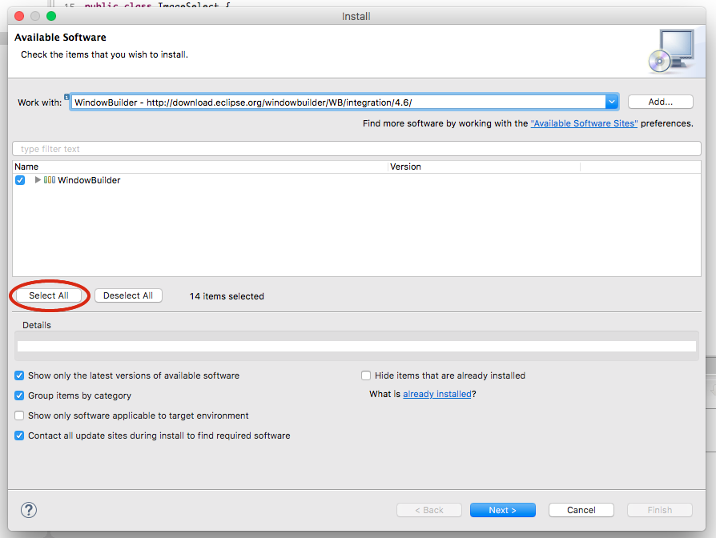

As of the Neon release, Eclipse does not have WindowBuilder installed by default. That [may change](https://bugs.eclipse.org/bugs/show_bug.cgi?id=498276) in the future, but for now, we can isntall it manually. We'll use WindowBuilder to create GUI interfaces.

## Add WindowBuilder site

In Eclipse, go to **Help > Install New Software**. In the dialog that opens, select **Add**.

This will open a dialog. Set the Name of the site to be **WindowBuilder** and the Location to be the following URL: `http://download.eclipse.org/windowbuilder/WB/integration/4.6/`

Hit OK, then Select all within the Install window, and Next. This should complete the install process. You'll be prompted to restart Eclipse so the changes can take effect.

